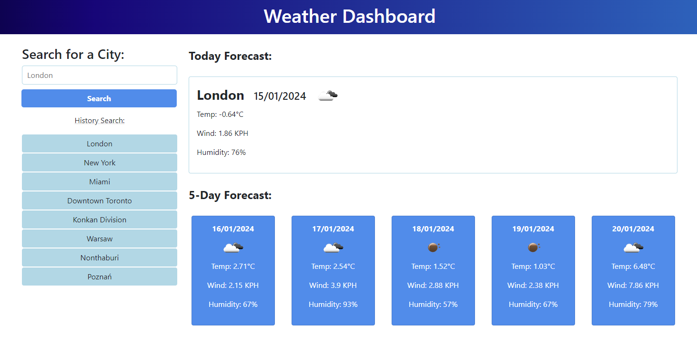

# Weather-Dashboard

## Description
This project aims to create a Weather Forecast App. Users can search for a city and view both current and future weather conditions for that location. The city is then added to the search history, providing a convenient way to access previously searched locations. The deployed webpage serves as a comprehensive overview of the project and facilitates easy connections for others.

The app runs in the browser and features dynamically updated HTML and CSS powered by jQuery.

## Features
- This application assigns the user's input to a variable and uses it to fetch data from the OpenWeather API.
- It dynamically updates HTML and CSS using jQuery to display current and future weather conditions to the user.
- Users are presented with the following data:
    - City name
    - Date
    - Icon representation of weather conditions
    - Temperature
    - Humidity
    - Wind speed
- Every city searched by the user is saved in local storage and displayed as a button in the search history.
- All search history buttons can be clicked to display new data; only city names get saved in local storage. After the click event, a new fetch request is sent.
- Even after a page refresh, all search history buttons remain intact.

## Usage
Simply navigate to the application and interact with the intuitive user interface to manage your daily schedule effortlessly.

After opening the code in the browser the resulting analysis looks as following:

The [URL](https://paulinasiwko.github.io/Weather-Dashboard/) of deployed application.

## Technologies Used

- 
-  
- 
- 
- 
- Day.js
- OpenWeather API
